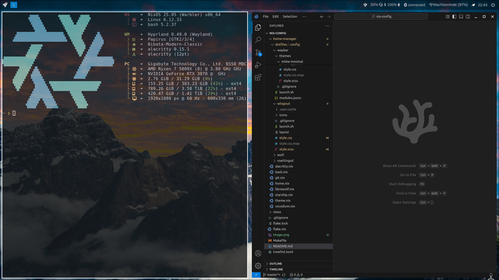

# ❄️ My NixOS Config



## Installation

Before installing this configuration, consider changing the following:

1. Set your username, description and home directory in `flake.nix`.
2. Change the hardware module in `flake.nix` if you use another hardware than I currently use.
3. Copy or replace your dotfiles if you already have some with the dotfiles in `home-manager/dotfiles`. Ensure that all the folders and files you want to install are listed in `home-manager/home.nix`.
4. Change the email and name for Git in `home-manager/git.nix`

Then run the following commands:

```bash
nix develop
make update nixos home
```

After installing this configuration, restart and check if everything still works. If you did not previously set a password, the initial password is `nixos`. You should immediately change the password with the command `passwd`.

## Software

- Display manager: Hyprland
- Screenshot utility: Hyprshot
- Locker: Swaylock
- Wayland Bar: Waybar
- Terminal emulator: Alacritty
- File manager: Nemo
- Browser: Librewolf
- App menu: Wofi
- Editor: VS Codium

## Credits

- Hypr config and waybar theme: https://github.com/mylinuxforwork
- Wofi config: https://github.com/binoymanoj
- Power menu shell script: https://github.com/mxdevmanuel
- Doubly warped black hole wallpaper: https://svs.gsfc.nasa.gov/14146/#media_group_314682
- Dolomites mountains wallpaper: https://www.hdwallpapers.in/dolomites_mountains_4k-wallpapers.html _(No original artist could be found)_
